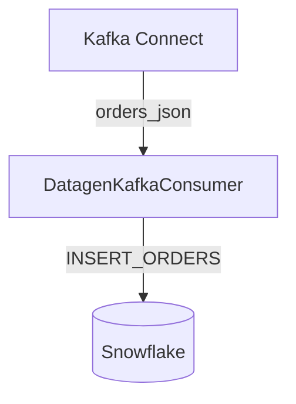

# Kafka Consumer Snowflake .NET Demo Application

Application that demonstrates how to consume messages from a Kafka topic and insert them into a Snowflake database using a .NET application. The application uses the Confluent.Kafka library to consume messages from the "orders_json" topic. The "orders_json" topic is populated using Kafka Connect and the [Datagen Source Connector](https://www.confluent.io/hub/confluentinc/kafka-connect-datagen). The `DataGenConsumer` inserts the orders into the Snowflake database using a stored procedure called `INSERT_ORDERS`. This README.md file provides instructions for installing and running the application.




## Prerequisites

To run this project, it is required to have the following installed on your machine:

1. [.NET 7 Runtime](https://dotnet.microsoft.com/en-us/download/dotnet/7.0).

2. [Docker and Docker Compose](https://docs.docker.com/get-docker/).

3. A valid [Snowflake account](https://signup.snowflake.com/?utm_source=google&utm_medium=paidsearch&utm_campaign=na-us-en-brand-trial-exact&utm_content=go-rsa-evg-ss-free-trial&utm_term=c-g-snowflake%20trial-e&_bt=586482103839&_bk=snowflake%20trial&_bm=e&_bn=g&_bg=136172947348&gclsrc=aw.ds&gad_source=1&gclid=CjwKCAjwseSoBhBXEiwA9iZtxt0sNRQf-tX3MLCnmYlJHjGZKriQMQ5gwESnCpz5HeDo6drja5YvexoCbMcQAvD_BwE). Snowflake allows you to sign up for a 30-Day free trial.

## How to Run the Application

1. Clone the repository to your local machine.

2. Open a terminal or command prompt and navigate to the root directory of the cloned repository.

3. Run `docker-compose up -d` in order to spin up all the containers using docker-compose. This will run all the necessary Kafka services for this application.
   - Zookeeper
   - Kafka Broker
   - Kafka Connect

4. Using your command line, run the following command in your terminal to create and start a Datagen Kafka Source Connector using the configured `orders-config.json` file included in the repository. WARNING, this may take a few seconds to get a successful response, it can take some time for the broker and kafka connect to startup.

   **Linux - using CURL**
   
   ```bash
   curl -X POST -H "Content-Type: application/json" --data @orders-config.json http://localhost:8083/connectors
   ```
   
   **Powershell equivalent**
   ```powershell
   Invoke-RestMethod -Method Post -ContentType "application/json" -InFile "orders-config.json" -Uri "http://localhost:8083/connectors"
   ```

   The `orders-config.json` file configures the Datagen Kafka Source Connector.
   
   ```json
   {
       "name": "datagen-orders",
       "config": {
         "connector.class": "io.confluent.kafka.connect.datagen.DatagenConnector",
         "kafka.topic": "orders_json", // Topic name that Kafka will produce messages to.
         "quickstart": "orders", // Quickstart schema provided by Confluent. They have several to choose from or you can use your own.
         "key.converter": "org.apache.kafka.connect.storage.StringConverter",
         "value.converter": "org.apache.kafka.connect.json.JsonConverter",
         "value.converter.schemas.enable": "false",
         "max.interval": 3000, // Milliseconds between producing messages to the topic.
         "iterations": 100, // How many messages that the source connector will publish.
         "tasks.max": "1" // controls the number of tasks that will be created for the connector. Each task is responsible for processing a subset of the data for the connector.
       }
     }
   ```

   This application uses the provided Order schema provided by Confluent. However, they have several other [examples](https://github.com/confluentinc/kafka-connect-datagen/tree/master/src/main/resources) that are great for mocking data that you want to consume in a Kafka Topic.
   
   You can even specify your own Schema if you want! See the following [article](https://thecodinginterface.com/blog/kafka-connect-datagen-plugin/) for more details.

5. Run the following command using your terminal to validate that your connector is in a "RUNNING" status:

   **Linux - using CURL**
   
   ```bash
   curl http://localhost:8083/connectors/datagen-orders/status
   ```
   
   **Powershell equivalent**
   ```powershell
   Invoke-RestMethod -Method Get -Uri "http://localhost:8083/connectors/datagen-orders/status"
   ```

6. Set the following application secrets using Environment Variables. The `SnowflakeDbConfig` class will attempt to read all the Snowflake credentials and secrets using Environment Variables to build the Connection String to connect to Snowflake.

   **Debugging Locally**
   
   Modify `launch.json` file and set the `SNOWFLAKE_ACCOUNT / SNOWFLAKE_USERNAME / SNOWFLAKE_PASSWORD` environment variables to your Snowflake credentials.
   ```json
   "env": {
      "ASPNETCORE_ENVIRONMENT": "Development",
      "SNOWFLAKE_ACCOUNT": "...",
      "SNOWFLAKE_USERNAME": "...",
      "SNOWFLAKE_PASSWORD": "...",
   },
   ```
   
   **Using dotnet run**

   Modify `launchSettings.json` file and set the `SNOWFLAKE_ACCOUNT / SNOWFLAKE_USERNAME / SNOWFLAKE_PASSWORD` environment variables to your Snowflake credentials.
   ```json
   "profiles": {
    "http": {
      "commandName": "Project",
      "dotnetRunMessages": true,
      "launchBrowser": true,
      "applicationUrl": "http://localhost:5034",
      "environmentVariables": {
        "ASPNETCORE_ENVIRONMENT": "Development",
        "SNOWFLAKE_ACCOUNT": "...",
        "SNOWFLAKE_USERNAME": "...",
        "SNOWFLAKE_PASSWORD": "...",
      }
    },
   }
   ```

7. Using a terminal, navigate to the `DataGenConsumer` folder and run the following command in your terminal to run the Kafka Consumer.

   ```bash
   dotnet run
   ```